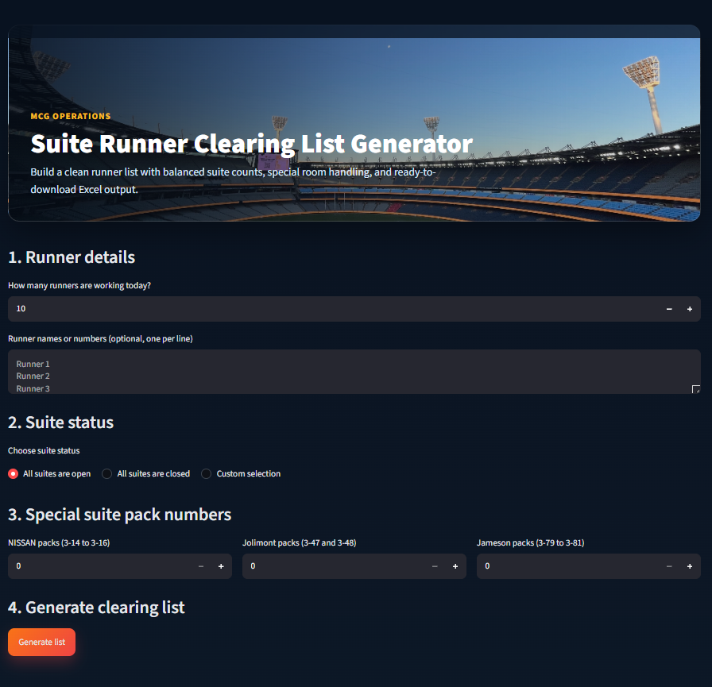
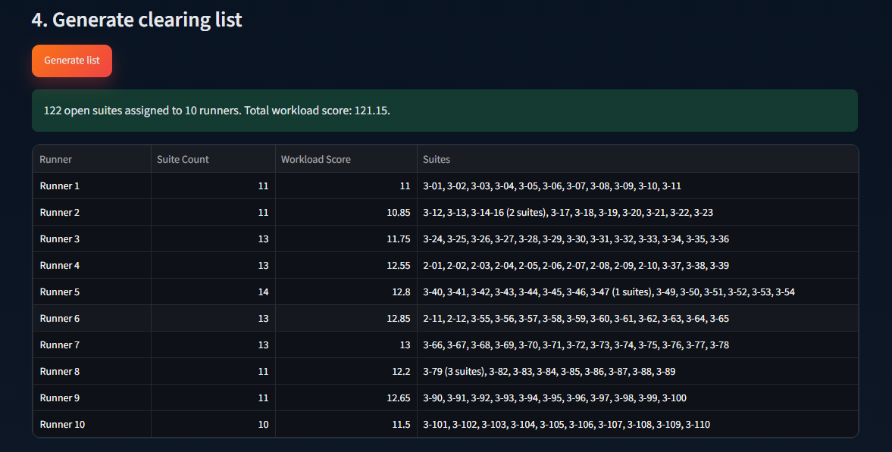
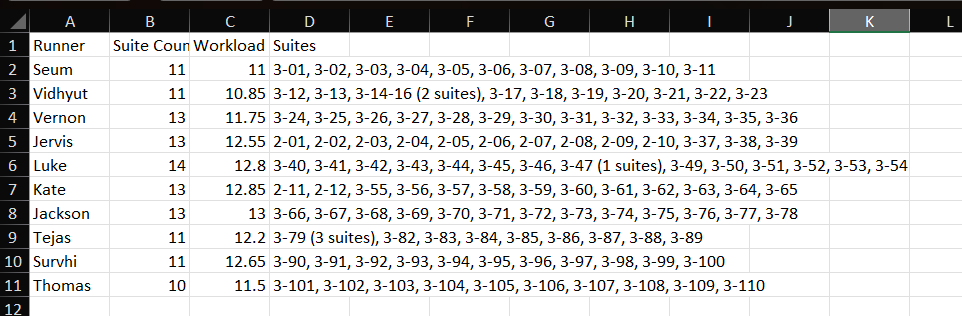

# MCG Corporate Suite Assignment Optimizer


An intelligent **Python** and **Streamlit** application developed to automate the allocation of **Melbourne Cricket Ground (MCG) Corporate Suites** among event-day runners.

The system replaces the traditional manual assignment process by balancing workloads, applying operational business rules, handling special suite requirements, and generating downloadable Excel reports within seconds.

---

# 🌐 Live Demo

**Try the application here**

👉 https://mcgrunnerlist.streamlit.app

---

# 📖 Project Overview

Managing Corporate Suite assignments manually during event days can be time-consuming and often results in uneven workloads among runners.

This application was developed to automate the assignment process by intelligently distributing suites based on operational constraints and workload balancing principles.

The system enables supervisors to generate consistent and fair runner assignments with only a few clicks.

---

# ✨ Features

- Automated Corporate Suite allocation
- Intelligent workload balancing
- Fair suite distribution among runners
- Support for custom runner names
- Open / Closed suite selection
- Special suite handling:
  - Nissan Suites
  - Jolimont Suites
  - Jameson Suites
- Interactive Streamlit dashboard
- Automatic Excel report generation
- Modern and responsive user interface

---

# 🛠 Technologies Used

- Python
- Streamlit
- Pandas
- OpenPyXL

---

# 📂 Project Structure

```text
mcg-corporate-suite-assignment-optimizer/
│
├── app.py
├── requirements.txt
├── README.md
├── LICENSE
├── assets/
│   └── MCG_Pic.jpeg
└── screenshots/
    ├── homepage.png
    ├── assignment.png
    └── excel-output.png
```

---

# 📸 Screenshots

## Home Page



---

## Generated Assignment



---

## Excel Output



---

# 🚀 Installation

Clone the repository

```bash
git clone https://github.com/TRSeum445/mcg-corporate-suite-assignment-optimizer.git
```

Navigate into the project directory

```bash
cd mcg-corporate-suite-assignment-optimizer
```

Install the required packages

```bash
pip install -r requirements.txt
```

Run the application

```bash
streamlit run app.py
```

---

# 💼 Business Problem

Preparing Corporate Suite runner assignments manually can:

- Take significant planning time
- Produce uneven workloads
- Increase the chance of human error
- Create inconsistencies between events

---

# 💡 Solution

The **MCG Corporate Suite Assignment Optimizer** automates the assignment process by:

- Calculating balanced workloads
- Applying operational business rules
- Keeping related suites together
- Supporting special suite requirements
- Generating downloadable Excel reports

This significantly improves planning efficiency while ensuring a fair distribution of work among runners.

---

# 📈 Skills Demonstrated

- Python Programming
- Algorithm Design
- Workload Optimization
- Business Process Automation
- Data Processing
- Streamlit Development
- Excel Report Generation
- User Interface Design
- Problem Solving

---

# 🔮 Future Improvements

- User authentication
- Historical assignment reports
- Database integration
- PDF report generation
- Event templates
- Mobile responsiveness
- Performance analytics dashboard

---

# 👨‍💻 Author

**Tarikur Rahman Seum**

Bachelor of Cybersecurity  
La Trobe University

GitHub: https://github.com/TRSeum445

---

## ⭐ If you found this project useful, please consider giving it a star!
